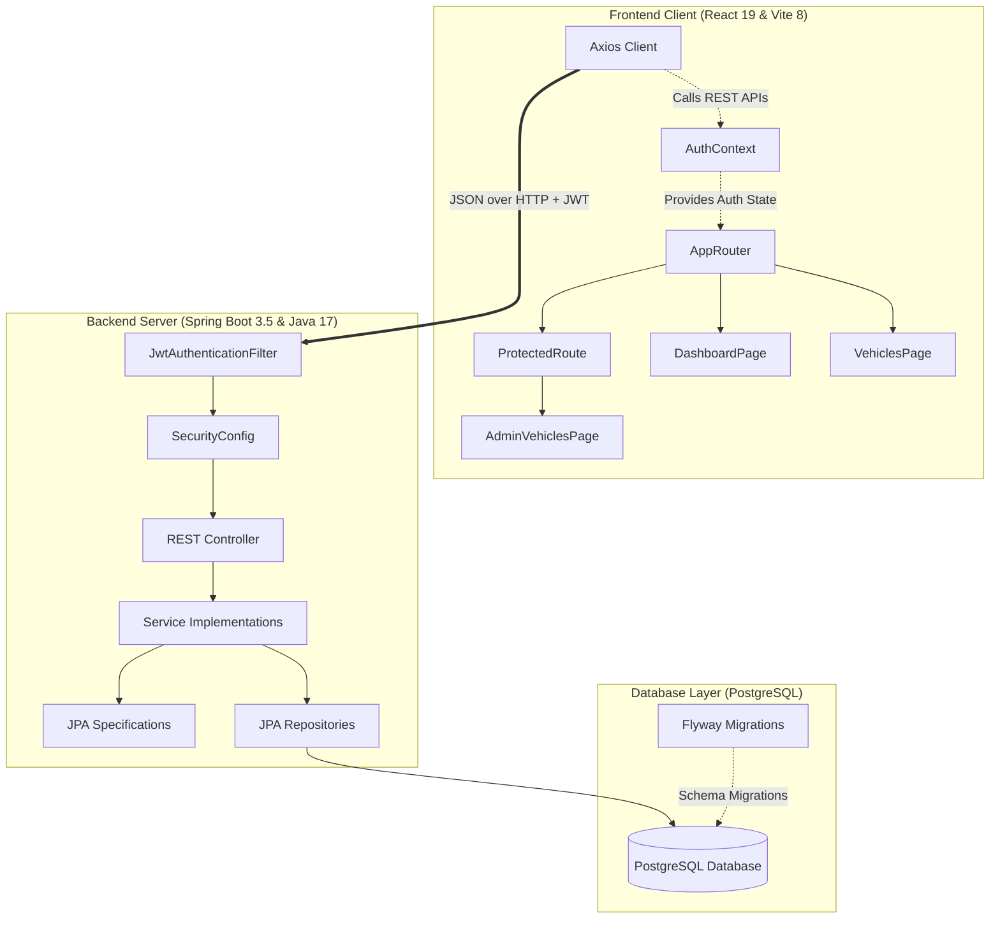
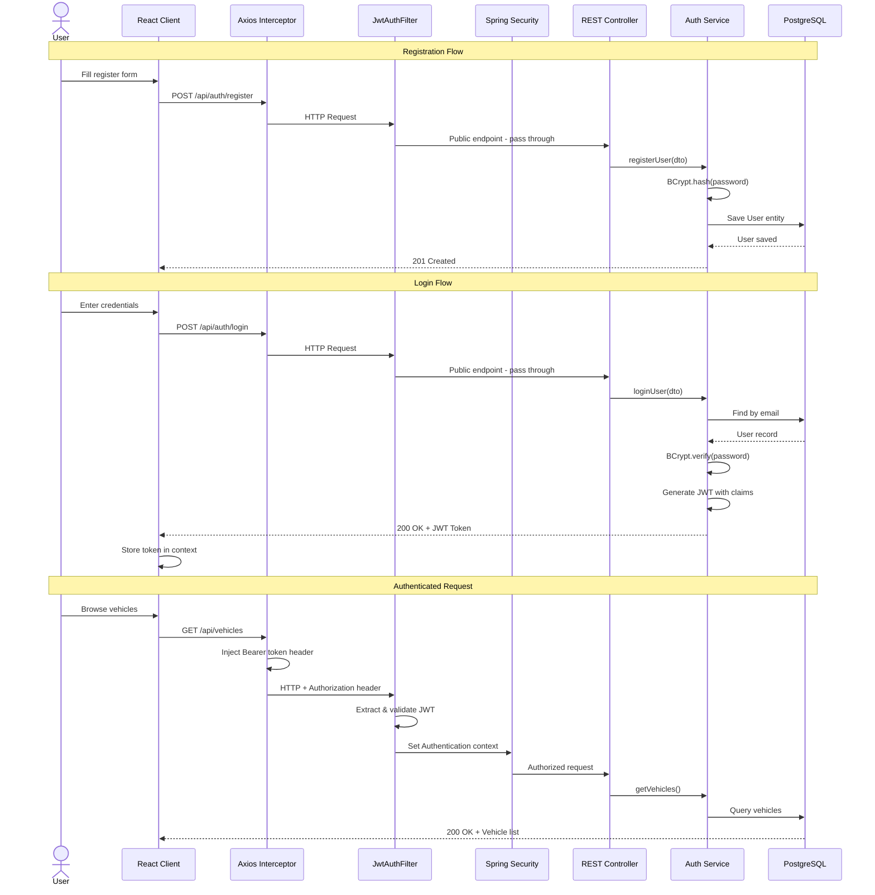
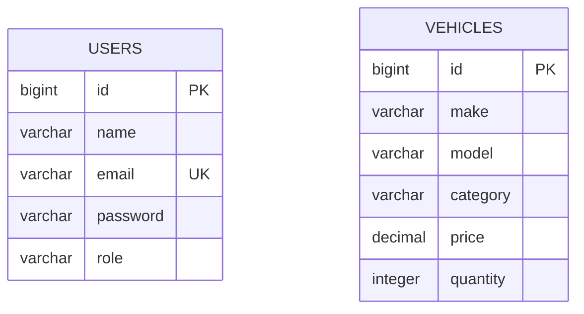
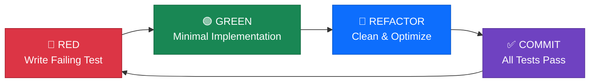
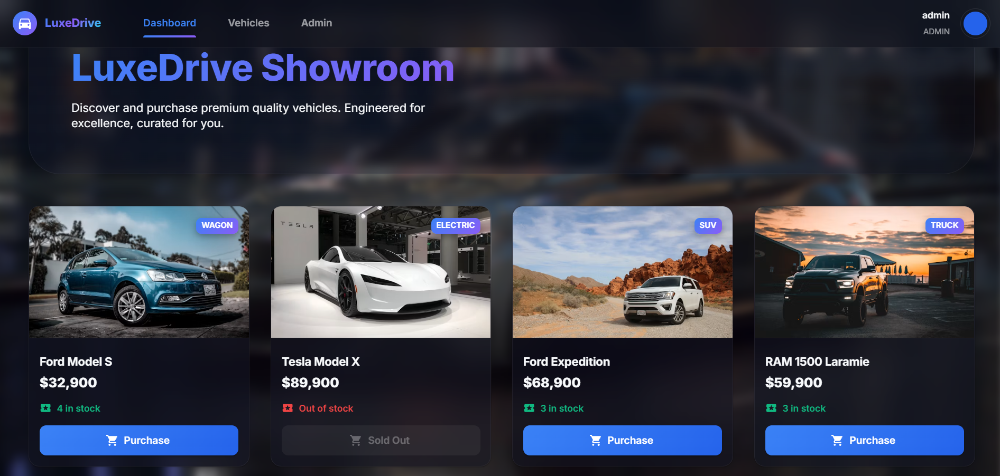
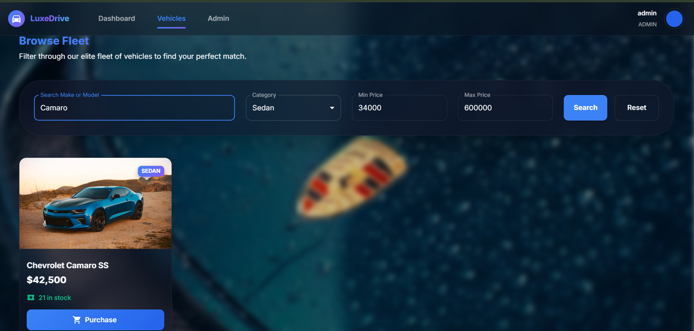
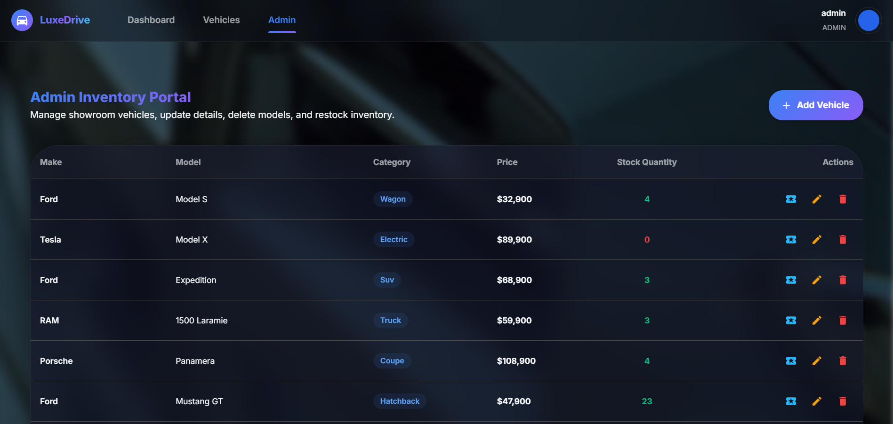
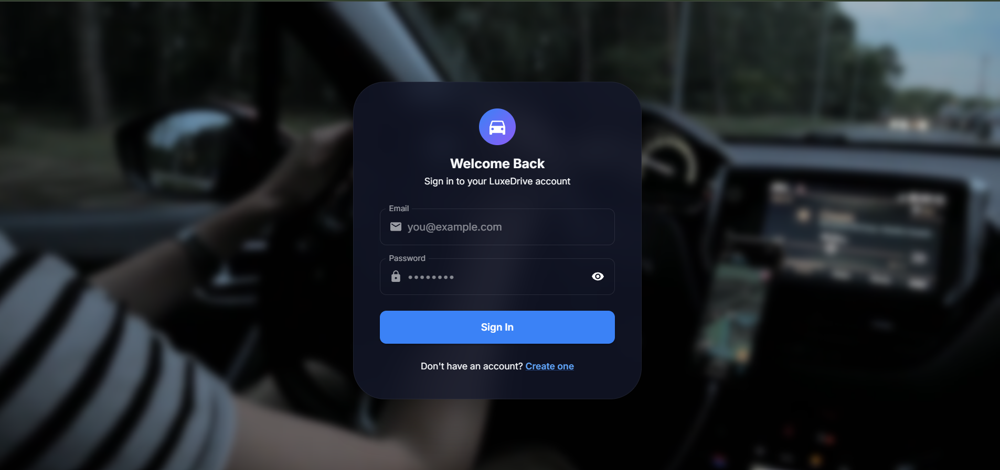
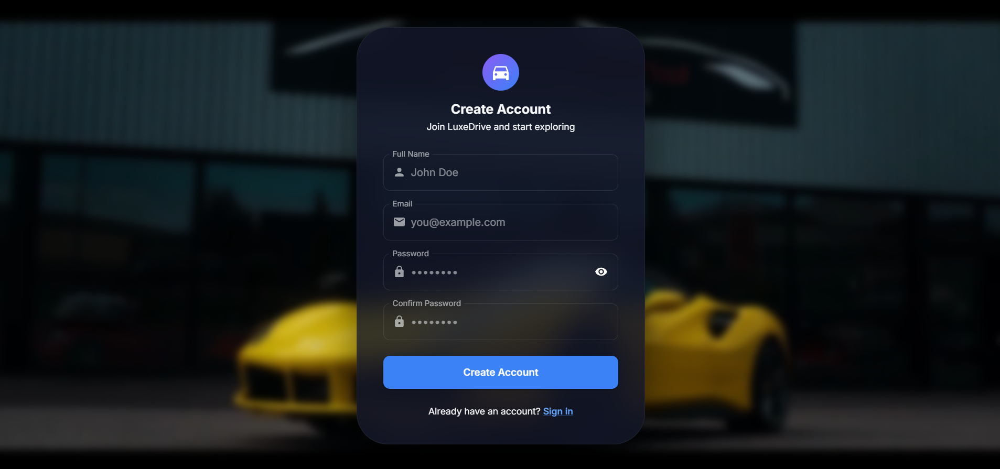

<h1 align="center">🚗 LuxeDrive</h1>
<h3 align="center">Premium Car Dealership &amp; Inventory Management System</h3>

<p align="center">
  
  
  
  
  
</p>

<p align="center">
  
  
  
  
  
  
  
  
</p>

<br/>

<details>
<summary><h2>📑 Table of Contents</h2></summary>

| # | Section | Description |
|:---:|:---|:---|
| 1 | [🌟 Project Overview](#-project-overview) | What LuxeDrive is and what it does |
| 2 | [🏆 Why This Project Stands Out](#-why-this-project-stands-out) | Key highlights for evaluators |
| 3 | [🔗 Live Demo](#-live-demo) | Deployed links & demo credentials |
| 4 | [✨ Features](#-features) | Core features list |
| 5 | [🎯 Skills Demonstrated](#-skills-demonstrated) | Technical competencies mapped to code |
| 6 | [💻 Tech Stack](#-tech-stack) | Technologies used (backend & frontend) |
| 7 | [🏗️ Architecture Overview](#%EF%B8%8F-architecture-overview) | System design, JWT flow, DB schema & TDD workflow diagrams |
| 8 | [📁 Project Structure](#-project-structure) | Full directory tree |
| 9 | [📷 Screenshots](#-screenshots) | Application screenshots |
| 10 | [⚙️ Environment Variables](#%EF%B8%8F-environment-variables) | Configuration reference |
| 11 | [🚀 Installation & Running Locally](#-installation--running-locally) | Step-by-step setup guide |
| 12 | [📦 Build Instructions](#-build-instructions) | Production build commands |
| 13 | [📖 API Documentation](#-api-documentation) | REST endpoint reference |
| 14 | [🔒 Authentication & Security](#-authentication--security) | Security architecture & access matrix |
| 15 | [🧪 Testing](#-testing) | How to run tests |
| 16 | [📊 Test Report](#-test-report) | Full test results (109/109 passing) |
| 17 | [🌐 Deployment](#-deployment) | Vercel & Render deployment details |
| 18 | [💡 Design Decisions & Trade-offs](#-design-decisions--trade-offs) | Architectural reasoning & trade-offs |
| 19 | [🔮 Future Improvements](#-future-improvements) | Planned enhancements |
| 20 | [🤖 My AI Usage](#my-ai-usage) | Transparent AI usage disclosure |
| 21 | [👤 Author](#-author) | Contact information |
| 22 | [📄 License](#-license) | MIT License |

</details>

---

## 🌟 Project Overview

**LuxeDrive** is a full-stack car dealership inventory system built following a strict test-driven development (TDD) workflow. It pairs a robust Spring Boot / PostgreSQL backend with a polished, media-rich React single-page application (SPA).

The application features a dark luxury aesthetic, role-based access control (Standard User and Admin), dynamic vehicle cataloging, inventory adjustment actions (purchasing and restocking), multi-parameter search and filtering, and a full-screen ambient video background with low-volume audio for an immersive showroom experience.

---

## 🏆 Why This Project Stands Out

<table>
  <tr>
    <td align="center" width="25%">
      <h3>🧪 109 Tests</h3>
      <p>100% pass rate across<br/>62 backend + 47 frontend<br/>assertions with strict TDD</p>
    </td>
    <td align="center" width="25%">
      <h3>🔐 Enterprise Security</h3>
      <p>Stateless JWT auth,<br/>BCrypt hashing, role-based<br/>access on both tiers</p>
    </td>
    <td align="center" width="25%">
      <h3>🏗️ Production Architecture</h3>
      <p>Feature-based packages,<br/>JPA Specifications, Flyway<br/>migrations, global error handling</p>
    </td>
    <td align="center" width="25%">
      <h3>🚀 Deployed Live</h3>
      <p>CI/CD with Vercel +<br/>Render + Neon PostgreSQL,<br/>Dockerized backend</p>
    </td>
  </tr>
</table>

---

## 🔗 Live Demo

| | Link |
|:---|:---|
| 🌐 **Frontend App** | [LuxeDrive Web Client](https://car-dealership-inventory-system-rho.vercel.app) |
| ⚡ **Backend API** | [LuxeDrive API Base](https://car-dealership-inventory-system-5pci.onrender.com) |

### 🔑 Demo Credentials

Use these credentials to explore the application without registering:

| Role | Email | Password |
|:---|:---|:---|
| 👤 **Standard User** | `kishan@gmail.com` | `kishan` |
| 🛡️ **Admin** | `admin@example.com` | `kishan@admin2` |

> [!NOTE]
> - **Frontend** is hosted and deployed on **Vercel**.
> - **Backend** is deployed on **Render** (using PostgreSQL database hosted on **Neon**).
> - **Inactivity Sleep**: Because Render uses a free instance, the backend service may spin down after periods of inactivity. It can take approximately **30–60 seconds** to wake up on the first API request.

---

## ✨ Features

- 🔒 **Role-Based Token Authentication** — Secure token-based registration and login with automatic client route guards and server-side request verification using JWT.
- 🚗 **Dynamic Showroom Dashboard** — A responsive card layout displaying real-time stock levels, pricing, category badges, and quick action buttons.
- 🔍 **Advanced Search & Filtering** — Multi-criteria search on the backend (make, model, category, min/max price) matching with a responsive slide-out filters panel on the frontend.
- 🛒 **Purchase Flow** — Real-time validation preventing purchase of out-of-stock items, with immediate quantity decrement.
- 🛠️ **Admin Operations Hub** — Dedicated management page for Admin users with forms to add new vehicles, update existing details, delete entries, and restock quantities.
- 🎵 **Showroom Ambiance** — Looping background video with subtle, low-volume soundtrack playback triggered on first user interaction for an immersive feel.

---

## 🎯 Skills Demonstrated

> _This section maps the technical competencies demonstrated in this project to where they are implemented — useful for evaluators assessing specific skills._

<table>
  <tr>
    <th align="left" width="30%">Skill Area</th>
    <th align="left" width="70%">Where It's Applied</th>
  </tr>
  <tr>
    <td><strong>🔧 Object-Oriented Design</strong></td>
    <td>Feature-based package structure, entity inheritance, service/repository abstraction layers, DTO pattern for API contracts</td>
  </tr>
  <tr>
    <td><strong>🗄️ Relational Databases</strong></td>
    <td>PostgreSQL schema design, Flyway versioned migrations (V1–V3), JPA entity mappings, dynamic query building with <code>Specification&lt;Vehicle&gt;</code></td>
  </tr>
  <tr>
    <td><strong>🔐 Application Security</strong></td>
    <td>Stateless JWT authentication, BCrypt password hashing, Spring Security filter chain, CORS policy, role-based endpoint protection</td>
  </tr>
  <tr>
    <td><strong>🌐 RESTful API Design</strong></td>
    <td>Resource-oriented endpoints, proper HTTP verbs and status codes, request validation with Bean Validation API, global exception handling</td>
  </tr>
  <tr>
    <td><strong>⚛️ Modern Frontend</strong></td>
    <td>React 19 functional components, Context API state management, custom hooks (<code>useAuth</code>), protected route guards, Axios interceptors</td>
  </tr>
  <tr>
    <td><strong>🎨 UI/UX Engineering</strong></td>
    <td>Glassmorphism design system, MUI v9 theme customization, Framer Motion animations, responsive layouts, ambient media integration</td>
  </tr>
  <tr>
    <td><strong>🧪 Testing & TDD</strong></td>
    <td>109 assertions across 19 test suites, Red→Green→Refactor discipline, MockMvc for API tests, React Testing Library for component tests, JSDOM mocking</td>
  </tr>
  <tr>
    <td><strong>🚀 DevOps & Deployment</strong></td>
    <td>Multi-stage Docker builds, Vercel frontend CI/CD, Render backend deployment, Neon cloud PostgreSQL, environment-based configuration</td>
  </tr>
  <tr>
    <td><strong>📝 Clean Code Practices</strong></td>
    <td>Helper method extraction, single-responsibility services, Lombok boilerplate reduction, Oxlint code quality enforcement, descriptive commit messages</td>
  </tr>
</table>

---

## 💻 Tech Stack

### Backend
- **Framework:** Spring Boot 3.5.16 (Java 17)
- **Security & Auth:** Spring Security (Stateless JWT token auth via io.jsonwebtoken 0.12.6)
- **ORM & Database:** Spring Data JPA with PostgreSQL runtime driver
- **Migrations:** Flyway Database Migrations (V1, V2, V3 scripts)
- **Testing:** JUnit 5, Mockito, MockMvc, Spring Security Test
- **Tooling:** Lombok, Maven Wrapper (`mvnw`), Validation API

### Frontend
- **Framework:** React 19.2.7 (Vite 8.1.1)
- **UI Components:** Material-UI (MUI) v9.2.0 (with @emotion/react and @emotion/styled)
- **Routing:** React Router DOM v7.18.1
- **HTTP Client:** Axios v1.18.1 (configured with interceptors for JWT injection)
- **Animations:** Framer Motion v12.42.2
- **Testing:** Vitest v4.1.10, React Testing Library, JSDOM
- **Linter:** Oxlint v1.71.0

---

## 🏗️ Architecture Overview

The system uses a decoupled client-server architecture. The frontend application consumes RESTful APIs exposed by the backend Spring Boot server.



### Key Architectural Patterns
1. **Feature-Based Package Structure**: The backend is organized by business feature (`auth`, `vehicle`, `security`, `common`) to ensure clean separation of concerns and maintainability.
2. **Stateless JWT Security**: Spring Security intercepts HTTP requests, parses the JWT header, and injects authentication details into the security context. No server-side sessions are maintained.
3. **Repository Pattern & JPA Specifications**: High-performance database operations with Spring Data JPA and dynamically constructed SQL criteria for search queries using `Specification<Vehicle>`.
4. **Global Exception Handling**: Dedicated backend global advisor to catch custom and validation exceptions, mapping them to standard JSON error structures and HTTP status codes.

### 🔐 JWT Authentication Flow



### 🗄️ Database Schema



### 🔄 TDD Workflow

Every feature was built following this strict cycle:



### 📈 Git Discipline & TDD Commit History

This project follows a strict **3-commit-per-feature** pattern, evidencing disciplined TDD:

```
Commit Pattern (per feature):
┌──────────────────────────────────────────────────────────────────┐
│  Commit 1:  🔴 RED    — Add failing tests for [feature]        │
│  Commit 2:  🟢 GREEN  — Implement [feature] to pass tests      │
│  Commit 3:  🔵 REFACTOR — Clean up [feature] implementation    │
└──────────────────────────────────────────────────────────────────┘

---

## 📁 Project Structure

.
├── backend/                           # Spring Boot Backend Code
│   ├── .mvn/                          # Maven Wrapper files
│   ├── src/
│   │   ├── main/
│   │   │   ├── java/com/kishan/backend/
│   │   │   │   ├── auth/              # Authentication Feature Module
│   │   │   │   │   ├── controller/    # Auth API endpoints (register, login)
│   │   │   │   │   ├── dto/           # Request/Response payloads
│   │   │   │   │   ├── entity/        # User & Role JPA models
│   │   │   │   │   ├── exception/     # Custom auth-related exceptions
│   │   │   │   │   ├── repository/    # JPA repositories for User
│   │   │   │   │   └── service/       # Business implementation of register & login
│   │   │   │   ├── vehicle/           # Vehicle Feature Module
│   │   │   │   │   ├── controller/    # Vehicle API endpoints (search, purchase, restock)
│   │   │   │   │   ├── dto/           # Request/Response payloads
│   │   │   │   │   ├── entity/        # Vehicle JPA model
│   │   │   │   │   ├── exception/     # Custom inventory exceptions
│   │   │   │   │   ├── repository/    # JPA repositories for Vehicle
│   │   │   │   │   └── service/       # Business logic (CRUD, purchase, restock)
│   │   │   │   ├── security/          # Spring Security & JWT Setup
│   │   │   │   ├── common/            # Shared exception handlers
│   │   │   │   └── BackendApplication.java # Spring Boot startup class
│   │   │   └── resources/
│   │   │       ├── db/migration/      # Flyway SQL schema scripts
│   │   │       └── application.yaml   # Environment configuration
│   │   └── test/                      # JUnit 5 & Mockito Tests
│   ├── pom.xml                        # Maven dependency configuration
│   └── mvnw.cmd                       # Maven executable for Windows
│
├── frontend/                          # React Single Page Application (SPA)
│   ├── public/                        # Static public resources
│   ├── src/
│   │   ├── api/                       # Axios setup & HTTP client
│   │   ├── assets/                    # Media files (background video, music)
│   │   ├── components/                # Reusable UI components
│   │   │   ├── common/                # Ambient video and audio controls
│   │   │   └── vehicle/               # Vehicle display cards
│   │   ├── context/                   # React Authentication Context state
│   │   ├── hooks/                     # Custom React hooks (useAuth)
│   │   ├── layouts/                   # Dashboard main layout with appbar
│   │   ├── pages/                     # Main page components
│   │   │   ├── admin/                 # Admin inventory management pages
│   │   │   ├── DashboardPage.jsx      # Showroom display page
│   │   │   ├── LoginPage.jsx          # Login screen
│   │   │   ├── RegisterPage.jsx       # Registration screen
│   │   │   └── VehiclesPage.jsx       # Search & filters page
│   │   ├── routes/                    # Router mapping & Protected Routes
│   │   ├── services/                  # API communication layer
│   │   ├── utils/                     # Formatting utilities & constants
│   │   ├── index.css                  # Global CSS variables & layout
│   │   ├── theme.js                   # Material UI theme setup (glassmorphic)
│   │   └── main.jsx                   # React DOM entry point
│   ├── package.json                   # NPM script & dependencies
│   ├── vite.config.js                 # Vite compile configurations
│   └── setupTests.js                  # Vitest mock environment setup
```

---

## 📷 Screenshots

### Dashboard


### Search & Filter


### Admin Panel


### Login


### Register


---

## ⚙️ Environment Variables

The project uses environment variables to avoid hardcoding credentials. They are defined in the tables below:

### Backend Variables (`backend`)

| Variable Name | Description | Example / Placeholder Value |
| :--- | :--- | :--- |
| `DB_URL` | PostgreSQL Connection String | `jdbc:postgresql://ep-super-thunder-atsaxnet.c-9.us-east-1.aws.neon.tech/neondb?sslmode=require` |
| `DB_USERNAME` | Database username | `neondb_owner` |
| `DB_PASSWORD` | Database password | `your_postgres_password` |
| `JWT_SECRET` | Secret key used to sign JWTs (min 256-bit) | `replace_with_secure_secret_containing_32_bytes_or_more` |
| `PORT` | Spring Boot API server port | `8080` |
| `FRONTEND_URL` | Origin allowed for CORS requests | `http://localhost:5173` |

### Frontend Variables (`frontend`)

| Variable Name | Description | Example / Placeholder Value |
| :--- | :--- | :--- |
| `VITE_API_BASE_URL` | Base URL of the backend REST API | `http://localhost:8080/api` |

---

## 🚀 Installation & Running Locally

### Prerequisites
- **Java Development Kit (JDK) 17** installed and configured.
- **Node.js** (v18.x or higher) and **npm** installed.
- A **PostgreSQL** database (e.g. local install or hosted at Neon).

### Step 1: Clone the Repository
```bash
git clone https://github.com/kantariya/car-dealership-inventory-system.git
cd car-dealership-inventory-system
```

### Step 2: Environment Configuration
Create a `.env` file in the project root directory. Do not commit this file to Git.
```env
# Database Configuration
DB_URL=jdbc:postgresql://localhost:5432/dealership_db
DB_USERNAME=postgres
DB_PASSWORD=your_password

# Security Configuration
JWT_SECRET=replace_with_secure_secret_containing_32_bytes_or_more

# Frontend Configuration
VITE_API_BASE_URL=http://localhost:8080/api
FRONTEND_URL=http://localhost:5173
```

### Step 3: Run the Backend Service
1. Open a new terminal in the root folder and navigate to `backend`:
   ```bash
   cd backend
   ```
2. Build and download dependencies:
   ```bash
   ./mvnw clean install
   ```
3. Run the Spring Boot application:
   ```bash
   ./mvnw spring-boot:run
   ```
* The backend will start on port `8080` (`http://localhost:8080`).
* Flyway migrations run automatically on startup to initialize schemas.

### Step 4: Run the Frontend Client
1. Open a second terminal, navigate to `frontend`:
   ```bash
   cd frontend
   ```
2. Install npm dependencies:
   ```bash
   npm install
   ```
3. Configure the local environment variables file:
   ```bash
   # Copy the example file
   cp .env.example .env
   ```
4. Start the Vite dev server:
   ```bash
   npm run dev
   ```
* The client dashboard will open at `http://localhost:5173`.

---

## 📦 Build Instructions

### Backend Production Build
To package the Spring Boot backend into a single executable `.jar` file, run:
```bash
cd backend
./mvnw clean package -DskipTests
```
The output `.jar` file is saved under `backend/target/backend-0.0.1-SNAPSHOT.jar`.

### Frontend Production Build
To build the React application for production (generating static assets optimized for speed):
```bash
cd frontend
npm run build
```
The optimized bundle will be created in the `frontend/dist` folder, ready to be served or uploaded.

---

## 📖 API Documentation

The backend REST API is secure, mapping authorization permissions to user roles.

### Authentication Endpoints
| HTTP Method | Endpoint | Description | Request Body | Authorization |
| :--- | :--- | :--- | :--- | :--- |
| `POST` | `/api/auth/register` | Register a new user | `{"name", "email", "password", "role"}` | Public |
| `POST` | `/api/auth/login` | Authenticate & get JWT | `{"email", "password"}` | Public |

### Vehicles Management Endpoints
| HTTP Method | Endpoint | Description | Request Body | Authorization |
| :--- | :--- | :--- | :--- | :--- |
| `POST` | `/api/vehicles` | Add a new vehicle | `CreateVehicleRequest` | Admin Only |
| `GET` | `/api/vehicles` | List all available vehicles | *None* | Authenticated |
| `GET` | `/api/vehicles/search` | Search vehicles with filters | *Query Params* (make, model, category, etc.) | Authenticated |
| `PUT` | `/api/vehicles/{id}` | Update vehicle details | `UpdateVehicleRequest` | Admin Only |
| `DELETE` | `/api/vehicles/{id}` | Delete a vehicle | *None* | Admin Only |

### Inventory & Stock Endpoints
| HTTP Method | Endpoint | Description | Request Body | Authorization |
| :--- | :--- | :--- | :--- | :--- |
| `POST` | `/api/vehicles/{id}/purchase` | Purchase vehicle (decrement stock by 1) | *None* | Authenticated |
| `POST` | `/api/vehicles/{id}/restock` | Restock vehicle (increment stock) | `{"quantity"}` | Admin Only |

---

## 🔒 Authentication & Security

1. **Password Encryption**: All passwords stored in the database are hashed using the **BCrypt** hashing algorithm via Spring Security.
2. **Stateless JWT Authorization**:
   - On a successful login, the server responds with a signed JSON Web Token (JWT).
   - The token contains claims for user ID, email, name, and role.
   - The frontend stores the token in memory and cookies/local storage.
   - The frontend Axios client includes the token in the `Authorization: Bearer <token>` header of every outgoing request.
3. **Route Guards**:
   - React router guards (`ProtectedRoute`) block access to the dashboard for unauthenticated users.
   - Admin routes (`/admin/vehicles`) are locked specifically to users with the `ADMIN` role.
   - Database operations (write/edit/delete/restock) verify the role claims on the server-side, preventing unauthorized REST calls.

### Security Matrix

| Endpoint | Public | User | Admin |
|:---|:---:|:---:|:---:|
| `POST /api/auth/register` | ✅ | ✅ | ✅ |
| `POST /api/auth/login` | ✅ | ✅ | ✅ |
| `GET /api/vehicles` | ❌ | ✅ | ✅ |
| `GET /api/vehicles/search` | ❌ | ✅ | ✅ |
| `POST /api/vehicles/{id}/purchase` | ❌ | ✅ | ✅ |
| `POST /api/vehicles` | ❌ | ❌ | ✅ |
| `PUT /api/vehicles/{id}` | ❌ | ❌ | ✅ |
| `DELETE /api/vehicles/{id}` | ❌ | ❌ | ✅ |
| `POST /api/vehicles/{id}/restock` | ❌ | ❌ | ✅ |

---

## 🧪 Testing

LuxeDrive was developed using strict **Test-Driven Development (TDD)**: no production code was written before a corresponding failing test was created and committed (Red -> Green -> Refactor cycle).

### Executing Backend Tests
To run the Spring Boot unit and integration tests (JUnit 5, Mockito, MockMvc):
```bash
cd backend
./mvnw test
```

### Executing Frontend Tests
To run the React component, hooks, and context tests (Vitest, React Testing Library):
```bash
cd frontend
npm run test:run
```

---

## 📊 Test Report

Both backend and frontend test suites pass with a **100% success rate**.

```
================================================================================
                                 TEST RESULTS SUMMARY
================================================================================
Backend (JUnit 5 & Mockito):
  ✔ Active Test Suites: 8
  ✔ Passing Test Assertions: 62 / 62
  ✔ Failed / Skipped Tests: 0
  ✔ Components covered: AuthController, VehicleController, JwtService,
                        SecurityConfig, GlobalExceptionHandler, Service Layers.

Frontend (Vitest & Testing Library):
  ✔ Active Test Files: 11
  ✔ Passing Test Assertions: 47 / 47
  ✔ Failed / Skipped Tests: 0
  ✔ Components covered: AppRouter, AuthContext, MainLayout, DashboardPage,
                        VehiclesPage, RegisterPage, LoginPage, AdminVehiclesPage,
                        BackgroundVideo, BackgroundAudio, ProtectedRoute.
================================================================================
```

### Detailed Test Execution Breakdown

#### Backend Test Suite
- `BackendApplicationTests`: App Context Load (1/1 passed)
- `AuthControllerTest`: API registration and login validations (6/6 passed)
- `AuthServiceImplTest`: Hashing, JWT creation, repository integration (6/6 passed)
- `GlobalExceptionHandlerTest`: Validations, resource not found, out of stock, unauthorized error formatting (5/5 passed)
- `JwtServiceTest`: Token generation, claim extractions, signature validation (3/3 passed)
- `SecurityConfigTest`: Verification of public vs private route mappings (2/2 passed)
- `VehicleControllerTest`: CRUD endpoints, security intercept checks, purchase, restock permissions (26/26 passed)
- `VehicleServiceImplTest`: Business validation, quantity boundaries, transactional persistence (13/13 passed)
- **Total Backend Assertions: 62 / 62 Passed**

#### Frontend Test Suite
- `AppRouter`: Route routing, protected paths, admin validation (6/6 passed)
- `MainLayout`: Navigation controls, responsive layout, sidebar role bindings (3/3 passed)
- `DashboardPage`: Grid view loading skeleton, inventory render, action dispatching (6/6 passed)
- `AuthContext`: Log in state, storage sync, log out resets (7/7 passed)
- `BackgroundAudio`: Interaction triggering, soundtrack playback controls (2/2 passed)
- `ProtectedRoute`: Authentication redirection state (2/2 passed)
- `LoginPage`: Rendering, field updates, submit actions, login response bounds (4/4 passed)
- `BackgroundVideo`: Autoplay properties, cover styling, muted initialization (2/2 passed)
- `VehiclesPage`: Grid layout, filtering states, category binding (5/5 passed)
- `AdminVehiclesPage`: CRUD actions, add modal inputs, edit modal, delete confirmations, restock inputs (5/5 passed)
- `RegisterPage`: Validation error states, register trigger (5/5 passed)
- **Total Frontend Assertions: 47 / 47 Passed**

---

## 🌐 Deployment

### Frontend (Vercel)
The React application is deployed on **Vercel**:
- Built automatically from the Git repository branch (`main`).
- Configured with `vercel.json` rewrite rules to allow Single Page Application (SPA) HTML5 routing:
  ```json
  {
    "rewrites": [{ "source": "/(.*)", "destination": "/" }]
  }
  ```
- Environment variables: `VITE_API_BASE_URL` is set to point to the live Render API.

### Backend (Render)
The Spring Boot service is deployed on **Render**:
- Linked to a Neon PostgreSQL Database instance.
- Built using the Dockerfile located in the `backend/` directory:
  - Multi-stage build compiling Java classes with Maven, and running on a lightweight Eclipse-Temurin JDK JRE image.
- Environment variables set in Render: `DB_URL`, `DB_USERNAME`, `DB_PASSWORD`, `JWT_SECRET`.

---

## 🔮 Future Improvements

1. **Detailed Vehicle View Page** — Fully implement the `/vehicles/:id` route to show high-definition car photo galleries, dynamic performance specifications, and loan payment calculators.
2. **Sort & Pagination** — Implement backend sorting and page indexing for vehicle lists to improve loading speeds for large scale inventories.
3. **Advanced Dashboard Analytics** — Display sales graphs, stock depletion alerts, and category breakdown charts for Admin users.
4. **Multipart Image Upload** — Support storing and loading vehicle images via AWS S3 instead of relying on local placeholder assets.
5. **Real-time Notifications** — Implement WebSockets to notify other users immediately when a car goes out of stock or is refilled.

---

## 💡 Design Decisions & Trade-offs

> _This section explains the reasoning behind key architectural choices — the kind of thinking that goes beyond "it works" into "here's why it works this way."_

| Decision | Chosen Approach | Why | Trade-off |
|:---|:---|:---|:---|
| **Auth Strategy** | Stateless JWT | No session storage needed, scales horizontally, works seamlessly with SPA | Tokens can't be revoked server-side without a blacklist |
| **Search Implementation** | JPA Specifications | Composable, type-safe dynamic queries without raw SQL | Slightly more verbose than JPQL for simple queries |
| **DB Migrations** | Flyway (SQL-based) | Versioned, repeatable, works in CI/CD pipelines | Manual SQL scripts vs. auto-generated from entities |
| **Frontend State** | React Context API | Sufficient for auth state, avoids Redux complexity | Would need Redux/Zustand for more complex global state |
| **Styling** | MUI + Custom Theme | Rich component library, consistent glassmorphism theme | Larger bundle size vs. vanilla CSS |
| **API Client** | Axios with Interceptors | Centralized JWT injection, automatic 401 redirect | Extra dependency vs. native Fetch API |
| **Testing** | MockMvc (backend) + RTL (frontend) | Tests HTTP layer without server startup, tests user behavior not implementation | Integration tests would catch more cross-layer bugs |
| **Deployment** | Vercel + Render (free tier) | Zero-cost hosting for portfolio projects | Cold starts on Render free tier (30-60s wake time) |

---

## My AI Usage

This project was built solo using an AI-assisted, strict TDD workflow. AI tools acted as a pair-programmer for nearly every commit (51 of 54 commits in the project history are AI co-authored), but every line was reviewed, run, and understood before being committed. Below is a full, honest breakdown of what was used and how.

### AI Tools Used
- **Antigravity** (Google's agentic AI coding assistant, powered by Gemini) — the primary pair-programming tool used throughout backend and frontend development, appearing as `Co-authored-by: Antigravity` across the vast majority of commits.
- **Gemini 3.5 Flash** — used specifically for drafting the architectural layout, structured tables, and test reports of this documentation.

### How AI Was Used

1. **Enforcing the Red → Green → Refactor TDD cycle**
   Almost every feature in this repo followed a 3-commit pattern, and AI assisted at each stage:
   - *RED* — AI helped draft the initial failing unit/integration tests (e.g. `AuthControllerTest`, `VehicleServiceImplTest`, `AppRouter` tests, `AdminVehiclesPage` CRUD tests) before any implementation existed.
   - *GREEN* — AI helped write the minimum implementation code needed to make those tests pass (e.g. `AuthServiceImpl` registration/login logic, JWT generation via `JwtService`, vehicle purchase/restock endpoints, `DashboardPage` and `VehiclesPage` components).
   - *REFACTOR* — AI assisted in cleaning up passing code, such as extracting helper methods (`findVehicleById`, `buildSearchSpecification`, `mapToResponse`, `validateInStock`) and simplifying Spring Security/JWT configuration.

2. **Backend (Spring Boot) development**
   - Spring Security & JWT authentication filter setup, including stateless session policy and role-based endpoint protection.
   - Vehicle domain logic: creation, search (via JPA Specifications), update, deletion, purchase (with out-of-stock handling), and restocking, each backed by full unit and integration test coverage.
   - Global exception handling (`GlobalExceptionHandler`) mapping custom exceptions to correct HTTP status codes (400, 401, 403, 404).
   - PostgreSQL/Flyway configuration and environment-based Spring profiles (dev, prod, local).
   - CORS configuration for local frontend integration.

3. **Frontend (React) development**
   - Project scaffolding: Vite config, dependency selection (MUI, Framer Motion, Axios, React Router), and the Axios instance with a JWT interceptor and 401 auto-redirect.
   - `AuthContext`/`AuthProvider`, `ProtectedRoute`, `LoginPage`, and `RegisterPage`, including form validation and error handling.
   - `DashboardPage`, `VehiclesPage` (search/filter panel), and `AdminVehiclesPage` (full CRUD + restock dialogs), plus the reusable `VehicleCard` component.
   - Fixing recurring test issues surfaced during development, such as EMFILE errors from shallow MUI icon imports (resolved with deep imports), React 19 `act()` warnings, and `useMediaQuery`/`ThemeProvider` test wrapping.

4. **Rebranding & ambient media integration**
   - Built the `BackgroundVideo` and `BackgroundAudio` components (autoplay/loop/muted video background, low-volume audio triggered on first interaction), including their test suites and global Vitest mocks to avoid JSDOM memory issues.
   - Renamed the project from an earlier working name ("AutoVault") to **LuxeDrive** across pages, layouts, and tests, and applied the glassmorphism visual overhaul (backdrop-filter blur, translucent MUI overrides) to showcase the new background media.
   - Diagnosed and fixed flaky tests introduced by the media components — e.g. asserting on the `element.muted` DOM property instead of the attribute (since React binds `muted` as a property, not an attribute), and increasing timeouts on slower CI/VM test runs.

### What I Did Myself
- Reviewed, ran, and understood every AI-suggested change before committing it — no code was merged without being verified against the test suite.
- Made all product and architecture decisions (feature scope, role-based access model, package structure, styling direction, rebrand to LuxeDrive).
- Debugged failing/flaky tests and decided on the actual fixes to apply (AI proposed candidate fixes; I chose and validated the correct one in context).
- Wrote and curated commit messages, and structured the overall TDD workflow that AI was directed to follow at each step.

### Reflection
Using AI as a consistent pair-programmer sped up the mechanical parts of TDD — scaffolding failing tests, wiring up boilerplate Spring Security config, and mocking browser media APIs in Vitest — while I stayed responsible for design decisions, debugging judgment calls, and final review. The most valuable use was in JPA Specification-based dynamic search queries and HTML5 media mocking, both of which are easy to get subtly wrong by hand. The biggest risk of leaning on AI this heavily is losing track of *why* a fix works; I mitigated that by keeping every change scoped to a single failing test and confirming the suite was green before moving on.

---

## 👤 Author

- **Kishan Kantariya**
- **GitHub**: [@kantariya](https://github.com/kantariya)


---

<p align="center">
  <sub>Built with ❤️ using Test-Driven Development</sub><br/>
  <sub>⭐ Star this repo if you found it helpful!</sub>
</p>